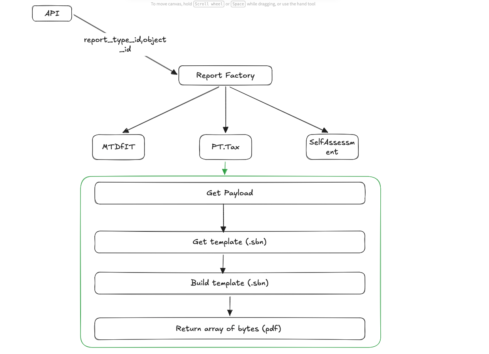

# Report Engine


### Folder structure

```bash
ReportService/
│
├── Api/
│   ├── Controllers/
│   │   └── ReportsController.cs
│   └── Program.cs
│
├── Application/
│   ├── Interfaces/
│   │   ├── IReportGenerator.cs
│   │   ├── ITemplateService.cs
│   │   └── IPdfService.cs
│   │
│   ├── Services/
│   │   ├── TemplateService.cs
│   │   ├── PdfService.cs
│   │   └── ReportFactory.cs
│   │
│   └── Generators/
│       ├── InvoiceReportGenerator.cs
│       └── PaymentReportGenerator.cs
│
├── Domain/
│   └── Models/
│       ├── InvoiceReportModel.cs
│       └── PaymentReportModel.cs
│
├── Infrastructure/
│   ├── Persistence/
│   │   └── PayloadRepository.cs   // fetch JSON from DB
│   │
│   └── Templates/
│       ├── invoice.sbn
│       └── payment.sbn
│
├── Shared/
│   └── DTOs/
│       └── ReportRequest.cs
│
├── Docker/
│   └── Dockerfile   // includes wkhtmltopdf if using DinkToPdf
│
└── ReportService.sln
```

### Data flow
